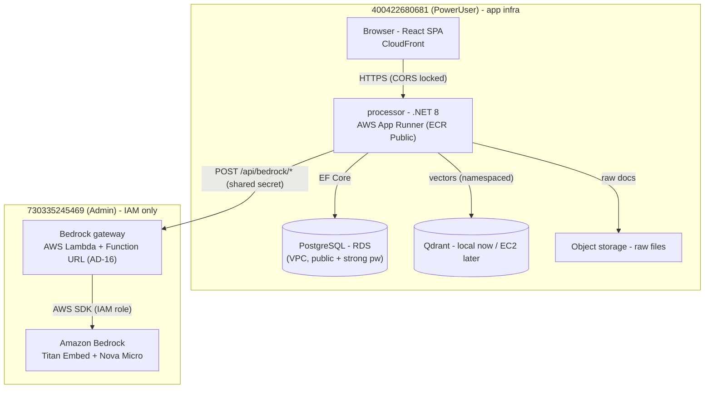
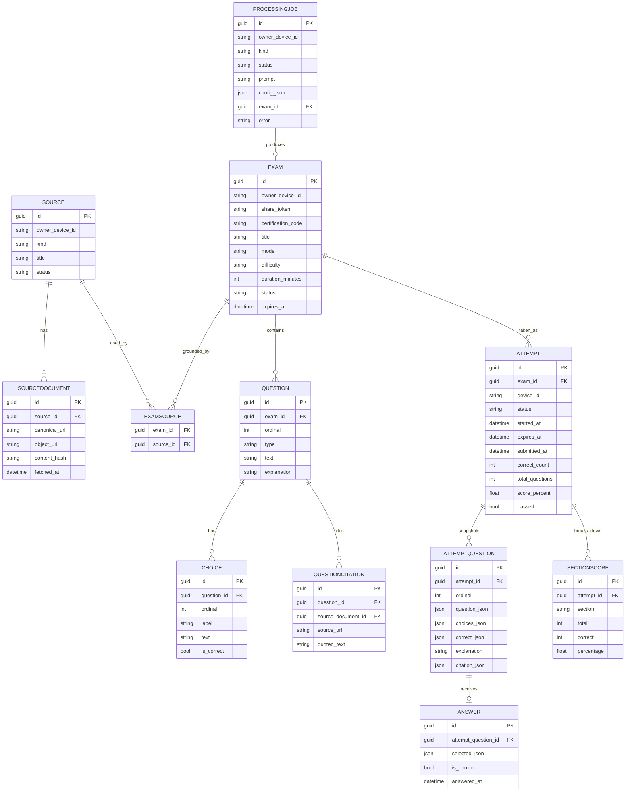

# Architecture Spine — ezCert ExamGenius v2

## Design Paradigm

**Layered service monorepo.** Three top-level folders with a strict outward dependency rule:

```
frontend/  (React SPA, static display)   ->   processor/  (.NET 8, sole backend)   ->   crawler/  (TS acquisition)
```

- The **processor** is the only system that writes PostgreSQL, Qdrant, or object storage.
- The **crawler** acquires public web content and emits neutral documents; it never reads the database, vectors, or user data.
- Inside the processor, vertical feature slices (`Features/`) sit on shared infrastructure adapters (`Infrastructure/`); no layered-architecture ceremony beyond that.

---

## Invariants & Rules

### AD-1 — Three-folder monorepo, processor owns all writes

- **Binds:** all
- **Prevents:** crawler touching user data; multiple services competing to write the database
- **Rule:** exactly three top-level source folders: `frontend/`, `processor/`, `crawler/`. Root holds only `docker-compose.yml`, `.env.example`, `README.md`. Dependency direction is `frontend → processor → crawler`. Only `processor/` may write PostgreSQL, Qdrant, or object storage. Rebuild lives on branch `rebuild/examgenius-v2`; prior implementation stays in git history.

### AD-2 — Guest device identity

- **Binds:** all mutation + ownership paths
- **Prevents:** authentication build-out before the core loop works; identity lock-in
- **Rule:** the processor issues an HttpOnly `guest_device_id` cookie on first request (UUID v4). No `User` table, no credentials, no SSO this round. Ownership checks (exam delete, attempt results, source visibility) compare the cookie value to the record's `device_id`. The cookie must be HttpOnly + SameSite=Lax; CSRF protection applies to mutations.

### AD-3 — Exam immutability + 3-day TTL

- **Binds:** exam lifecycle, sharing, attempts
- **Prevents:** silent mutation of shared exams; infinite storage growth
- **Rule:** an `Exam` with `status=ready` is immutable — no question/choice edits. `expires_at = created_at + 3 days`, set at creation. Access after expiry returns 410. A cleanup worker transitions expired exams to `status=archived`; `Question`, `Choice`, `Attempt`, and snapshot rows are retained for history. "Regenerate" always creates a new exam, never mutates the original.

### AD-4 — Share-by-link

- **Binds:** exam sharing
- **Prevents:** building recipient/permission models before identity exists
- **Rule:** sharing is a unique nullable `share_token` on `Exam`. Anyone with the link can start an attempt while the exam is alive. Deleting the exam invalidates the token (410 for takers). No recipient lists, no copy/fork, no per-user permissions in v1.

### AD-5 — Device-scoped snapshot attempts

- **Binds:** attempts, scoring, results, history
- **Prevents:** client-side scoring/tampering; history loss after archive
- **Rule:** starting an attempt copies each question into an immutable `AttemptQuestion` JSON snapshot (choices + correct + explanation + citation). Scoring is server-side on submit, from snapshots. An expired mid-attempt auto-scores from its snapshots. Results and history are accessible only to the owning `device_id`.

### AD-6 — Qdrant namespace isolation

- **Binds:** source ingestion, search, generation
- **Prevents:** cross-device chunk leakage
- **Rule:** every Qdrant operation carries a namespace payload filter: `official:{cert}` or `guest:{deviceId}:{sourceId}`. The processor sets the namespace from the authenticated cookie; the client never supplies it. No unnamespaced search except an admin rebuild (server-only flag).

### AD-7 — Async generation via ProcessingJob

- **Binds:** exam-jobs, generation, chat flow
- **Prevents:** blocking request paths; invalid questions entering the pool
- **Rule:** exam creation is a `ProcessingJob` (Postgres table is the queue; no broker/Redis). A background worker: resolves sources → chunks/embeds → Bedrock generates → validates (type, ≥2 choices, ≥1 correct, explanation, citation) with retry ≤3 → persists `Exam(ready)` + questions → marks job complete. The frontend polls job status. AI failures degrade to 503; official seeded content keeps working.

### AD-8 — Crawler provider contract

- **Binds:** URL ingestion
- **Prevents:** provider lock-in; the crawler becoming a data-owning agent
- **Rule:** the crawler exposes `POST /crawl {url, limit, includePaths} → CrawledDocument[]` where `CrawledDocument = {canonicalUrl, title, markdown, contentHash, fetchedAt, metadata}`. Provider interface with **Firecrawl** as the v1 default and **Crawlee** as the self-hosted fallback. Deterministic enforcement of domains, limits, robots, retries. The crawler never receives user documents or credentials, and never reads the database.

### AD-9 — Storage split

- **Binds:** persistence
- **Prevents:** the vector store becoming the source of truth
- **Rule:** PostgreSQL is authoritative (exams, attempts, jobs, sources); Qdrant holds derived vectors (rebuildable from raw docs); object storage (S3/local) holds raw files. No other stores.

### AD-10 — Deployment (two-account hybrid)

- **Binds:** delivery
- **Prevents:** dragging the whole stack to the admin account; running IAM-gated components where roles can't exist
- **Rule:** the old sandbox (`400422680681`, PowerUser) hosts all application infrastructure: CloudFront SPA, the App Runner processor, and VPC + RDS Postgres. The hackathon sandbox (`730335245469`, AWSAdministratorAccess) hosts **only** what needs a non-PowerUser IAM role: the Bedrock gateway service + its instance role (AD-14). SQLite is the local/dev fallback only — production uses RDS. CORS stays locked to the CloudFront origin + localhost; the gateway is server-to-server only (no CORS surface).

### AD-11 — Frontend is a static display layer

- **Binds:** frontend
- **Prevents:** business logic in the browser; fake server-side chat
- **Rule:** the SPA renders server data only; all scoring, ownership, and generation logic lives in the processor. Chat history is optional and browser-local only (localStorage/IndexedDB) — never authoritative.

### AD-12 — Tech stack

- **Binds:** all
- **Prevents:** unvetted new runtimes; dependency drift
- **Rule:** frontend = React 18 + TypeScript + Vite, CSS variables per `DESIGN.md` tokens. Processor = .NET 8 minimal API, EF Core + Npgsql, ASP.NET Core Identity not used (Guest mode), AWSSDK.BedrockRuntime, Qdrant.Client, PDF text extraction via a vetted .NET library (e.g. PdfPig). Crawler = TypeScript, Firecrawl SDK (v1) / Crawlee (fallback).

### AD-13 — Two-account split by IAM necessity

- **Binds:** all deployment
- **Prevents:** dragging the whole stack to the admin account; trying to run IAM-gated components where roles can't exist
- **Rule:** any component that requires a non-PowerUser IAM role lives in account `730335245469` (AWSAdministratorAccess). Everything else stays in `400422680681` (PowerUser). The rich account hosts only the Bedrock role + gateway; it never holds application state, the SPA, or the database.

### AD-14 — Bedrock gateway contract

- **Binds:** processor `Infrastructure/Bedrock`, gateway service
- **Prevents:** two divergent Bedrock implementations; the gateway becoming user-facing surface
- **Rule:** the rich account exposes exactly three endpoints behind a shared-secret bearer header (`Authorization: Bearer {secret}`), server-to-server only — no CORS, no user traffic, no browser access:
  - `POST /api/bedrock/embed` (Titan embed v2, 1024 dims)
  - `POST /api/bedrock/generate` (Nova micro)
  - `POST /api/bedrock/explain` (Nova micro)
  The processor keeps its `IBedrockClient` abstraction; hosted mode wires it to the gateway (`BedrockGateway__Url`, `BedrockGateway__Secret`); local dev uses direct Bedrock via SSO credentials.

### AD-15 — Hosted topology

- **Binds:** environments
- **Prevents:** environment drift between local and hosted
- **Rule:**
  ```text
  Browser → CloudFront SPA (400422680681)
                ↓
        App Runner: ezcert-processor (400422680681)
                ├─→ PostgreSQL (400422680681: VPC + RDS, public + strong password)
                ├─→ Qdrant (400422680681: local now, EC2 later)
                └─→ Bedrock gateway (730335245469: Lambda + Function URL + bedrock:InvokeModel execution role)
                       └─→ Bedrock
  ```
  Dev: local Postgres + Qdrant + direct Bedrock (SSO). Hosted: the topology above. The processor is the only writer of data; the gateway is stateless and holds no data.

### AD-16 — Gateway compute host: Lambda + Function URL

- **Binds:** gateway service hosting
- **Prevents:** staying on a deprecated compute host; new architecture churn in the rich account
- **Rule:** the Bedrock gateway runs as an AWS Lambda function (managed .NET 8 runtime, zip deploy, `AuthType: NONE` + in-app bearer secret) with a Function URL, in `730335245469` (us-east-1). It replaces the App Runner service, which is in AWS maintenance mode. The AD-14 contract — `/health` public, three bearer-protected endpoints, server-to-server — is unchanged; the processor only re-points `BedrockGateway__Url` at the Function URL. Lambda role = inline `bedrock-invoke` + `AWSLambdaBasicExecutionRole`.

---

## Consistency Conventions

| Concern | Convention |
|---------|-----------|
| Entity IDs | UUID v4 for rows; `guest_device_id` cookie is a UUID v4 string |
| Dates | UTC always; ISO 8601 in API responses; `DateTime` (UTC) in .NET |
| Error shape | RFC 9110 problem-details `{type, title, status, detail}`; 503 AI-degraded, 429 rate-limit, 410 expired, 404/400/409 domain |
| Qdrant namespace | string key `source_namespace` on every payload: `official:{cert}` / `guest:{deviceId}:{sourceId}` |
| Exam status | `generating | ready | archived | failed`; only `ready` is takeable |
| Attempt status | `in_progress | submitted | expired` |
| Cookies | `guest_device_id` HttpOnly, SameSite=Lax, Secure in production |
| API versioning | no versioning in v1; all routes under `/api/` |
| Frontend styling | CSS variables generated from `DESIGN.md` tokens; BEM-ish class names; no Tailwind runtime |
| Secrets | environment variables only; `.env.example` committed, real `.env` never |
| Branching | all v2 work on `rebuild/examgenius-v2` |
| Gateway auth | `Authorization: Bearer {secret}`; secrets via env only |
| Gateway env (processor) | `BedrockGateway__Url`, `BedrockGateway__Secret` |
| Gateway env (service) | `GATEWAY_SECRET`, `ASPNETCORE_URLS=http://0.0.0.0:8080` |
| Provider selection | `Bedrock:Mode` = `gateway` (hosted) \| `direct` (local SSO) |

---

## Stack

| Name | Version |
|------|---------|
| React | 18.3 |
| TypeScript | 5.x |
| Vite | 5.4 |
| .NET SDK | 8.0 |
| ASP.NET Core Minimal API | 8.0 |
| Entity Framework Core (Npgsql) | 8.0.x |
| PostgreSQL | 16 (Docker `postgres:16-alpine`) |
| Qdrant | 1.x (Docker/cloud) |
| Amazon Bedrock — Titan Embed v2 | `amazon.titan-embed-text-v2:0` (1024 dims) |
| Amazon Bedrock — Nova Micro | `amazon.nova-micro-v1:0` |
| AWSSDK.BedrockRuntime | 4.x |
| PDF text extraction | PdfPig (processor) |
| Firecrawl SDK | JS SDK (crawler, v1 provider) |
| Crawlee | (crawler, fallback provider) |
| AWS Lambda + Function URL (gateway) | rich sandbox `730335245469` (AD-16) |
| AWS App Runner + CloudFront/S3 (processor + SPA) | existing sandbox |

---

## Structural Seed

### Deployment topology



### Core entity model



---

## Capability → Architecture Map

| Capability | Lives in | Governed by |
|-----------|---------|------------|
| Guest cookie issuance/parsing | processor `Features/Guests` | AD-2 |
| Source upload / URL / official | processor `Features/Sources` | AD-6, AD-9 |
| Exam generation (chat flow) | processor `Features/Generation` (ProcessingJob) | AD-7 |
| Exam CRUD + list (mine/completed) | processor `Features/Exams` | AD-3 |
| Share-by-link + delete | processor `Features/Exams` | AD-4 |
| Attempt start/answer/submit/results | processor `Features/Attempts` | AD-5 |
| Crawl acquisition | crawler `providers/{firecrawl,crawlee}` | AD-8 |
| Bedrock access (hosted) | rich-account gateway `BedrockGateway/` (Lambda + Function URL) | AD-14, AD-15, AD-16 |
| SPA screens + local chat history | frontend `screens/` + `lib/chatHistory` | AD-11 |
| Deployment + CORS | App Runner (processor) + CloudFront (SPA) + Lambda (gateway), two-account | AD-10, AD-13, AD-16 |

---

## Deferred

- **Credentials / SSO / groups / password reset / achievements** — explicitly out this round; Guest identity (AD-2) is designed so a future `User.external_subject` can be added without migrating exam/share/attempt rows.
- **Copy/fork exams** — share is link-only (AD-4); fork needs ownership semantics beyond v1.
- **Server-side chat history** — chat is browser-local (AD-11); Conversation/Message tables are a later decision.
- **Crawlee as primary** — Firecrawl is the v1 provider behind the contract (AD-8); switching is a config change.
- **Redis/broker, multi-region, DB hosting (RDS vs Aurora)** — ProcessingJob table suffices for v1; revisit at scale.
- **Directory lookups / Identity Store integration** — requires central IAM admin; not in scope.
- **RDS durability hardening** (private subnets, VPC connector, TLS enforcement) — blocked while the old account lacks IAM; revisit when the rich account can host or an admin grants more.
- **Qdrant on EC2** — local for now (AD-15); EC2 hosting is a fast-follow once real generation lands.
