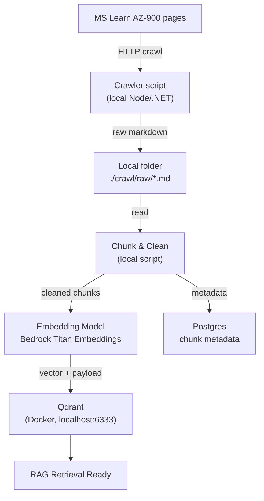
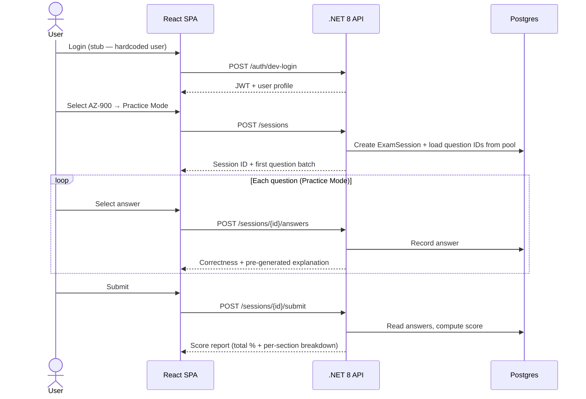
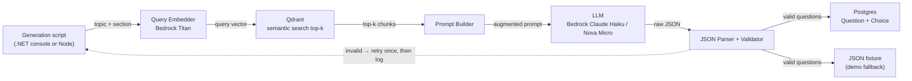
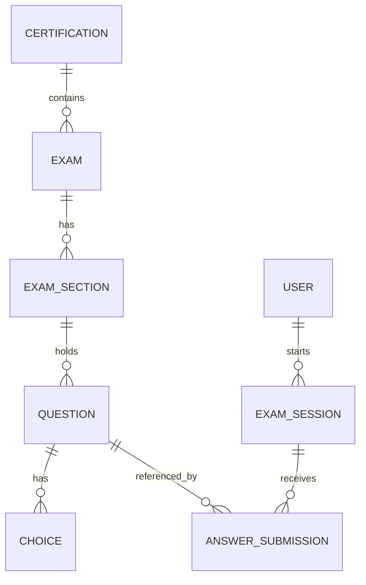

# EzCert — Phase 1 Hackathon Plan

> **Team:** 3 people · **Window:** 2 days · **Goal:** a working end-to-end demo, not a production system.
> Anything not explicitly listed as a Phase 1 deliverable is deferred to Phase 2.

---

## Section 0 — Scope Discipline (read first)

**In scope (Phase 1):**
- One certification only: **AZ-900**
- One exam mode: **Practice Mode** (immediate feedback)
- Local infrastructure only (Docker on dev laptops)
- ~30 pre-generated questions, stored in Postgres
- React SPA with login stub, question UI, score screen
- Bedrock is the only external cloud dependency

**Out of scope (Phase 2+):**
- Additional certifications (AWS CCP, GCP ACE)
- Certification Mode (timers, randomization, no-reveal)
- Credential issuance & public verification
- Real SSO
- AWS deployment (Lambda, S3 events, Fargate, CloudFront)
- Difficulty calibration (easy/medium/hard tagging)
- QuestionSnapshot, ScoreReport persistence, SectionScore tables

**Team split (3 devs):**
- **Dev A — RAG / Data:** crawler, chunking, embeddings, Qdrant, Bedrock question generation
- **Dev B — Backend API:** .NET 8 solution, EF Core, Catalog + Session endpoints, scoring
- **Dev C — Frontend:** React SPA, certification selector, question UI, score screen

**Tech choices locked for Phase 1:**
- **.NET 8 LTS** (not .NET 10 — avoid preview tooling risk)
- **Postgres 16** in Docker
- **Qdrant** in Docker (not EC2)
- **Bedrock** for embeddings (Titan) and generation (Claude Haiku or Nova Micro)

**Demo safety net:** every sprint produces a JSON fixture so the demo can fall back to canned data if a live service fails.

---

## Section 1 — Concept Definitions

**1. RAG Pipeline**
Offline ingestion: crawl AZ-900 MS Learn pages → clean & chunk → embed via Bedrock Titan → store vectors in Qdrant. At generation time, embed a topic query, retrieve top-k chunks, inject into the LLM prompt to ground question generation in real source material.

**2. Question Pool**
A Postgres table of generated questions. Each question belongs to an `ExamSection`, has 4 `Choice` rows, a correct-answer reference, and a pre-generated explanation. Phase 1: single-choice only, no difficulty tagging.

**3. Exam Session**
A Postgres record representing one user's run through a practice test. Holds the ordered list of question IDs and per-question answer submissions. No snapshotting in Phase 1 — sessions reference live `Question` rows directly.

**4. Catalog Management**
The admin domain: `Certification` → `Exam` → `ExamSection` → `Question` → `Choice`. Phase 1 seeds AZ-900 only, manually via a SQL script or EF seed.

**5. Scoring**
Computed on submit from `AnswerSubmission` rows — not persisted as its own report table in Phase 1. Returns total % and per-section breakdown in the response.

**6. Credential Issuance** *(Phase 2 — listed for context only, not built in Phase 1)*

---

## Section 2 — System Workflows

### 2.1 RAG Ingestion Pipeline (local)

### 2.2 User Exam Session Lifecycle (Practice Mode only)

### 2.3 AI Question Generation Flow (offline, run once before demo)

### 2.4 Core Data Model (Phase 1, slimmed)

> Phase 2 additions: `QuestionPool`, `QuestionSnapshot`, `ScoreReport`, `SectionScore`, `Credential`.

---

## Section 3 — Sprint Milestones

> Each sprint = ~4 hours × 3 devs. Tasks are sized to the **owning dev**, not the team total.
> Every sprint ends with a **go/no-go checkpoint**: if the key signal fails, fall back to the listed plan B.

---

### Sprint 1 — Foundation & Data Pipeline (Day 1 AM)

**Goal:** Real AZ-900 content is crawled, embedded, and semantically searchable in local Qdrant.

**Dev A (RAG):**
- Crawler script pulls 3–5 MS Learn AZ-900 pages into `./crawl/raw/*.md`
- Chunking script (fixed-size, ~500 tokens, 50-token overlap)
- Embed chunks via Bedrock Titan, upsert into local Qdrant
- Manual query check: "What is the difference between IaaS and PaaS?" returns relevant chunks

**Dev B (Backend):**
- .NET 8 solution scaffold (API + Domain + Infrastructure projects)
- Docker compose: Postgres + Qdrant
- EF Core: `Certification`, `Exam`, `ExamSection`, `Question`, `Choice` entities + initial migration
- Health check endpoint
- Seed AZ-900 + sections via EF seed data

**Dev C (Frontend):**
- Vite + React + TypeScript scaffold
- Routing skeleton: `/login`, `/select`, `/session/:id`, `/score/:id`
- API client wrapper (fetch + JWT header)
- Login stub page (button → calls dev-login endpoint, stores JWT)

**Go/no-go checkpoint (end of AM):** Top-3 Qdrant query returns IaaS/PaaS-relevant chunks.
**Plan B if it fails:** drop live crawl, use 3 hand-written markdown stubs and embed those.

---

### Sprint 2 — Question Generation + Catalog API (Day 1 PM)

**Goal:** ~30 valid AZ-900 questions sitting in Postgres, ready for delivery.

**Dev A (RAG):**
- Prompt builder: system prompt + retrieved chunks + JSON schema instruction
- Bedrock generation call (Claude Haiku or Nova Micro)
- JSON parser + validator (exactly 4 choices, exactly 1 correct, non-empty explanation)
- Retry once on validation failure, log + skip on second failure
- Run generation to produce ~30 questions; dump to `questions-fixture.json` AND insert into Postgres

**Dev B (Backend):**
- `GET /catalogs/certifications` → returns AZ-900 + sections
- `GET /catalogs/sections/{id}/questions` → returns questions for a section (no answers leaked)
- Repository layer + DTOs
- Dev-login endpoint issuing a JWT for a hardcoded user

**Dev C (Frontend):**
- Certification selector page (fetches catalog, picks AZ-900)
- "Start practice session" button wired to a stub backend response
- Question component (renders stem + 4 radio choices)
- Local component-level tests with fixture JSON

**Go/no-go checkpoint (end of PM):** ≥ 20 valid questions in Postgres.
**Plan B if generation reject rate > 50%:** use hand-written questions from the fixture file; demo still works.

---

### Sprint 3 — Session Lifecycle (Day 2 AM)

**Goal:** A user can complete a practice session end-to-end against the real backend.

**Dev A (RAG):**
- Wire `GET /questions/{id}/explanation` to return the **pre-generated** explanation from Postgres (no live LLM call in Phase 1)
- Polish question fixture, regenerate any low-quality items flagged in Sprint 2
- Document the prompt template in `rag-pipeline.md`

**Dev B (Backend):**
- `POST /sessions` → creates `ExamSession`, returns session + ordered question IDs
- `POST /sessions/{id}/answers` → records answer, returns correctness + explanation (Practice Mode)
- `POST /sessions/{id}/submit` → computes score (total % + per-section %), returns score report DTO
- Integration test: full happy path with seeded data

**Dev C (Frontend):**
- Session flow: fetch session → render questions one at a time → submit each answer → show correctness inline
- Submit-all button → calls submit endpoint → navigates to score screen
- Score screen: total %, per-section bars, list of wrong questions with explanations

**Go/no-go checkpoint (end of AM):** One team member completes a 10-question session end-to-end without errors.
**Plan B if backend integration breaks:** frontend reads `questions-fixture.json` directly and computes score client-side for the demo.

---

### Sprint 4 — Polish & Demo Prep (Day 2 PM)

**Goal:** A clean, repeatable 5-minute demo.

**Dev A (RAG):**
- Sanity-check 5 explanations against MS Learn source — flag any hallucinations, regenerate
- Prep a 1-slide "how RAG grounds the question" diagram for the demo

**Dev B (Backend):**
- Error handling + friendly error responses
- Seed reset script (`./scripts/reset-demo.ps1`)
- Logging on the generation and session endpoints for the live demo
- README with run instructions

**Dev C (Frontend):**
- Visual polish: loading states, error toasts, basic styling pass
- Score screen weak-area highlight (sections below 70%)
- Demo walkthrough rehearsal

**All three:**
- Write & rehearse demo script: login → select AZ-900 → 5-question practice → score → explanation
- Record a backup screen capture of a successful run (insurance against live-demo gremlins)

**Go/no-go checkpoint (1 hour before demo):** Two clean runs from `reset-demo.ps1` → demo end. Lock the build.

---

## Section 4 — Known Cuts & Phase 2 Backlog

Captured so we don't forget what we deferred:

- Second certification (AWS CCP or GCP ACE) — needs its own crawl + generation pass
- Certification Mode (server-side timer, randomized order, no-reveal-until-submit)
- Difficulty calibration (easy/medium/hard) — requires eval harness
- `QuestionSnapshot` + immutable session history
- Persisted `ScoreReport` + `SectionScore` + analytics
- Credential issuance + public verification endpoint
- Real SSO (Entra ID / Cognito)
- AWS deployment: Lambda crawler, S3 raw store, S3-event chunker, ECS Fargate API, CloudFront SPA, Bedrock IAM hardening
- Live LLM-generated explanations on demand (currently pre-generated)
- Multi-user concurrent sessions / load testing

---

## Section 5 — Cost & Risk Notes

**Bedrock spend (the only paid service in Phase 1):**
- Embeddings: ~50–200 chunks × Titan = pennies
- Generation: ~30 questions × ~2 KB output × Claude Haiku ≈ < $1
- Dev iteration overhead (re-running prompts while tuning): budget **$10–20**, not $5
- Total realistic Phase 1 spend: **< $25**

**Top risks:**
1. **Bedrock JSON reliability** — mitigated by validator + retry + fixture fallback
2. **Crawler breaks on MS Learn HTML changes** — mitigated by saving raw markdown to disk; re-runs are cheap
3. **Time slippage in Sprint 1** — Qdrant + .NET + React scaffolds in parallel is the riskiest moment; sprint plan B's exist for every checkpoint
4. **Live demo network issues** — mitigated by recorded backup run
