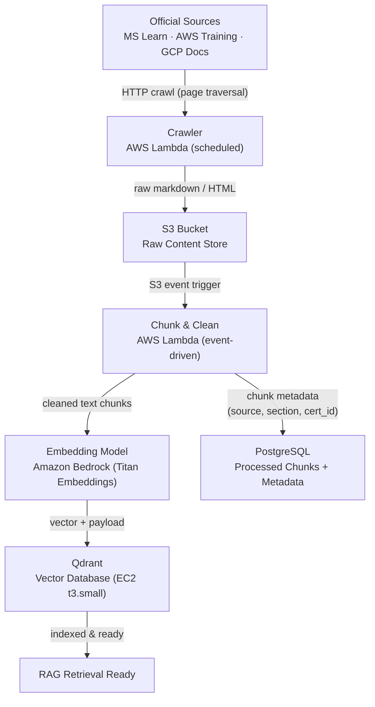
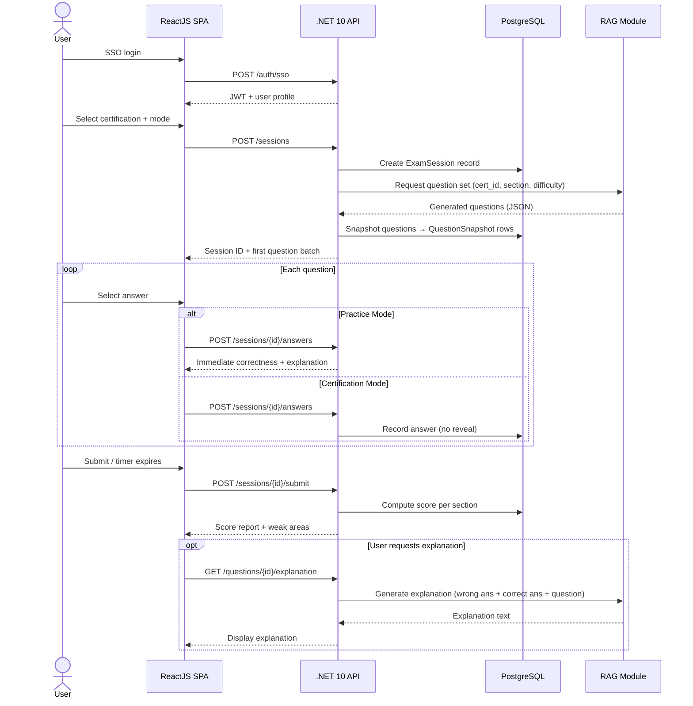
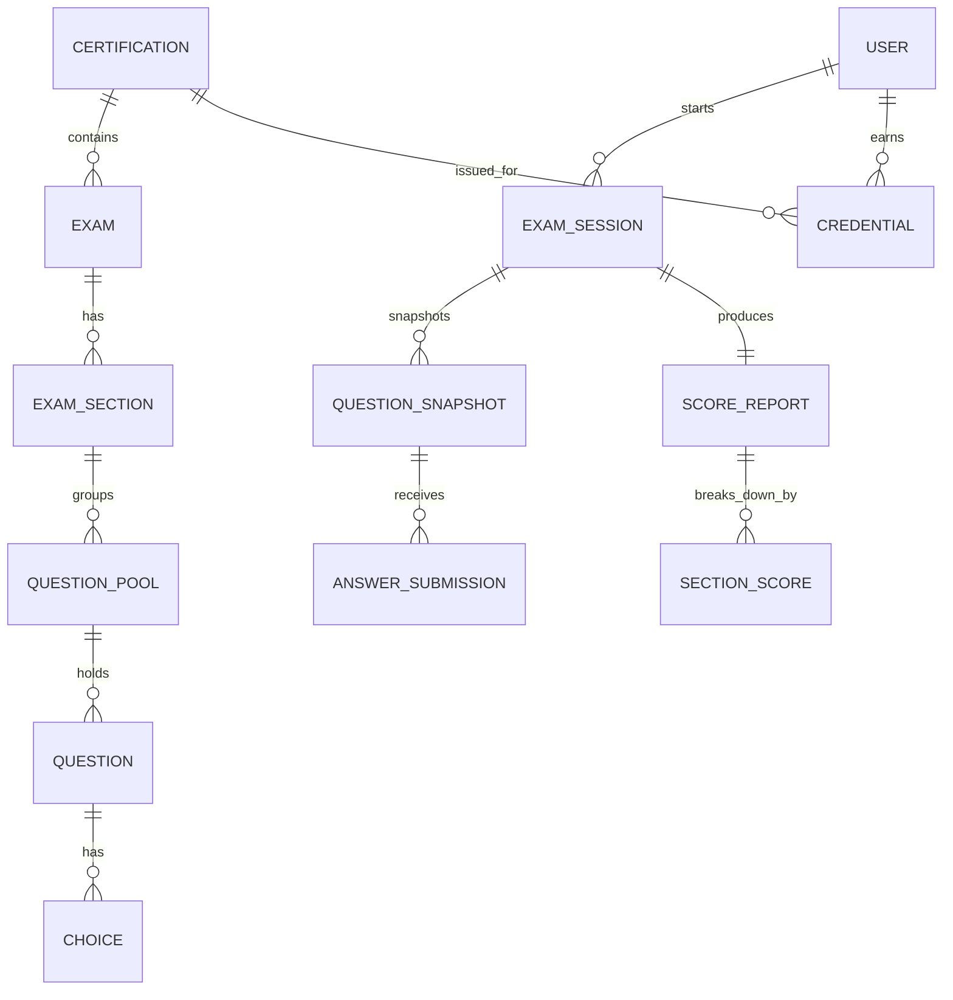

# EzCert — Phase 1 Hackathon Plan

---

## Section 1 — Concept Definitions

**1. RAG Pipeline**
The core intelligence layer. A continuous background process that crawls official certification documentation (MS Learn, AWS Training, GCP Docs), cleans and chunks the raw text, embeds those chunks via an embedding model, and stores the resulting vectors in Qdrant. At generation time, an incoming topic query is embedded and used to retrieve the top-k most semantically relevant chunks. Those chunks are injected as context into an LLM prompt, grounding question generation in current, authoritative source material rather than the model's static training data.

**2. Question Pool**
A PostgreSQL-backed catalog of generated (and optionally hand-authored) questions. Each question belongs to an `ExamSection`, carries a difficulty level (easy / medium / hard), a question type (single-choice, multiple-choice, true/false, dropdown), a set of `Choice` rows, a correct-answer reference, and a pre-generated explanation. The pool is the buffer between expensive LLM generation and fast question delivery — questions are generated ahead of time and drawn from the pool during live sessions.

**3. Exam Session**
A stateful record in PostgreSQL representing one user's active run through a test. It holds the selected mode (Practice or Certification), a timer baseline for Certification mode, an ordered list of `QuestionSnapshot` rows (immutable copies of questions as they were at session start), and per-question answer submissions. Snapshots decouple the live session from any future changes to the question pool.

**4. Catalog Management**
The administrative domain of the API. It manages the hierarchy: `Certification` → `Exam` → `ExamSection` → `QuestionPool` → `Question` → `Choice`. This hierarchy drives both the frontend certification selector and the RAG module's topic-scoping logic (i.e., "generate 5 hard questions for AZ-900 section: Cloud Concepts").

**5. Scoring & Analytics**
Post-session computation that calculates a per-section score breakdown, identifies weak areas (sections below a pass threshold), and persists results to PostgreSQL. In Practice Mode, scoring is per-question and immediate. In Certification Mode, scoring runs after final submission. The output drives both the score report UI and the AI-explanation request (which passes the wrong answer + correct answer + question text back to the RAG/LLM for a targeted explanation).

**6. Credential Issuance**
Once a user passes a Certification Mode exam above the configured pass score, the API issues a `Credential` record tied to the user and the certification. Credentials have an issued date, an expiry, a public verification token, and a revoke flag. The public verification endpoint is unauthenticated and token-gated — no PII exposed.

---

## Section 2 — System Workflows

### 2.1 RAG Ingestion Pipeline

### 2.2 User Exam Session Lifecycle

### 2.3 AI Question Generation Request Flow

```mermaid
flowchart LR
    QS["Question Service\n(.NET 10)"]
    EMBED_Q["Query Embedder\nBedrock Titan Embeddings"]
    QDRANT["Qdrant\nsemantic search top-k"]
    PROMPT["Prompt Builder\ninject retrieved chunks"]
    LLM["LLM\nAmazon Bedrock Claude / Nova"]
    PARSE["Response Parser\n& Validator"]
    POOL["PostgreSQL\nQuestion Pool"]
    RETRY["Retry / Flag for review"]

    QS -->|"topic + difficulty + cert_id"| EMBED_Q
    EMBED_Q -->|"query vector"| QDRANT
    QDRANT -->|"top-k relevant chunks"| PROMPT
    PROMPT -->|"augmented prompt\n(system + context + instructions)"| LLM
    LLM -->|"raw question JSON"| PARSE
    PARSE -->|"valid questions"| POOL
    PARSE -->|"schema violation / low quality"| RETRY
    POOL -->|"questions ready for delivery"| QS
```

### 2.4 Core Data Model

---

## Section 3 — Sprint Milestones

---

### Sprint 1 — Foundation & Data Pipeline (Day 1 AM)

**Goal:** Prove that real certification content can be crawled, chunked, embedded, and retrieved from Qdrant with a meaningful semantic search result.

**Deliverables:**
- PostgreSQL schema created: `Certification`, `Exam`, `ExamSection`, `Question`, `Choice`, `ProcessedChunk`
- `.NET 10` project scaffolded: solution structure, EF Core migrations, health check endpoint
- Crawler Lambda (or local script) runs against one MS Learn AZ-900 module and writes raw markdown to S3 (or local folder for hackathon)
- Chunking + embedding pipeline writes at least 50 vectors into Qdrant
- Manual semantic search query against Qdrant returns relevant chunks — verified by inspection

**Key experiment / early signal:** Can we retrieve the top-3 most relevant doc chunks for the query _"What is the difference between IaaS and PaaS?"_ from live MS Learn content? If yes, RAG groundedness is proven.

**AWS cost note:** Lambda (free tier covers hackathon volume), S3 standard (< $0.01 for KB-scale crawl), Qdrant on a single `t3.small` spot instance (~$0.007/hr). No RDS yet — use local PostgreSQL or a free-tier `db.t3.micro`.

---

### Sprint 2 — Backend API Core + Question Generation (Day 1 PM)

**Goal:** Generate a valid exam question from Qdrant-retrieved context via Bedrock and persist it to the question pool.

**Deliverables:**
- `POST /catalogs/certifications` and child CRUD endpoints working (Catalog Management)
- `QuestionService` calls Qdrant → builds prompt → calls Amazon Bedrock (Claude or Nova) → parses JSON response → inserts into `Question` + `Choice` tables
- Generation produces at least one question per difficulty level (easy / medium / hard) for AZ-900 Cloud Concepts
- Basic validation: question must have exactly 4 choices, exactly 1 correct answer; on failure, retry once then log for review
- `GET /catalogs/question-pools/{id}/questions` returns the generated questions

**Key experiment / early signal:** Does the LLM reliably emit structured JSON (question + choices + explanation) when given Qdrant-retrieved context? What is the reject rate on the first 10 calls?

**AWS cost note:** Bedrock is pay-per-token with no idle cost — ideal for hackathon. Use `anthropic.claude-3-haiku` or `amazon.nova-micro` for low-cost generation (~$0.0001–0.001 per question). No dedicated model endpoint needed.

---

### Sprint 3 — Exam Session + Frontend Shell (Day 2 AM)

**Goal:** A user can start a session from the React UI, answer questions drawn from the pool, and receive a score.

**Deliverables:**
- `POST /sessions`, `POST /sessions/{id}/answers`, `POST /sessions/{id}/submit` implemented in .NET 10
- `ExamSession` + `QuestionSnapshot` + `AnswerSubmission` + `ScoreReport` written to PostgreSQL on submit
- Practice Mode: immediate per-question feedback returned in the answer response
- React SPA: login stub (skip real SSO for hackathon), certification selector, question UI (single-choice + true/false), submit button, score screen
- Score screen shows: total %, per-section breakdown, list of wrong answers

**Key experiment / early signal:** Can a team member complete a 10-question AZ-900 practice session end-to-end — from question delivery to score report — without backend errors?

**AWS cost note:** React SPA deployed to S3 + CloudFront (static hosting, ~$0/month at hackathon traffic). Backend runs as a single ECS Fargate task (`0.25 vCPU / 0.5 GB`, ~$0.01/hr). No load balancer — use Fargate public IP for demo.

---

### Sprint 4 — AI Explanations + Certification Mode + Demo Polish (Day 2 PM)

**Goal:** Complete the full user journey including timed Certification Mode, on-demand AI explanations, and a demo-ready UI.

**Deliverables:**
- `GET /questions/{id}/explanation` — calls Bedrock with wrong answer context, returns explanation paragraph
- Certification Mode: server-side timer enforced, no per-question feedback until submit, randomized question order
- Frontend: timer display, explanation panel on score screen, weak-area highlight
- At least 2 certifications seeded (AZ-900 + one of AWS CCP or GCP ACE) with generated question pools
- End-to-end demo script: login → select AZ-900 → Certification Mode → complete 5 questions → view score → view explanation for one wrong answer

**Key experiment / early signal:** Does the explanation feature produce a response that correctly references why the wrong answer is incorrect vs. the correct answer — grounded in the source documentation? Validate by having a team member who knows AZ-900 review 5 explanations.

**AWS cost note:** Explanation calls are user-initiated and low-frequency. Bedrock cost remains per-token. Keep session timer logic server-side only (no polling — use a single `GET /sessions/{id}/status` call on submit to check expiry). Total estimated AWS spend for full demo day: < $5.
